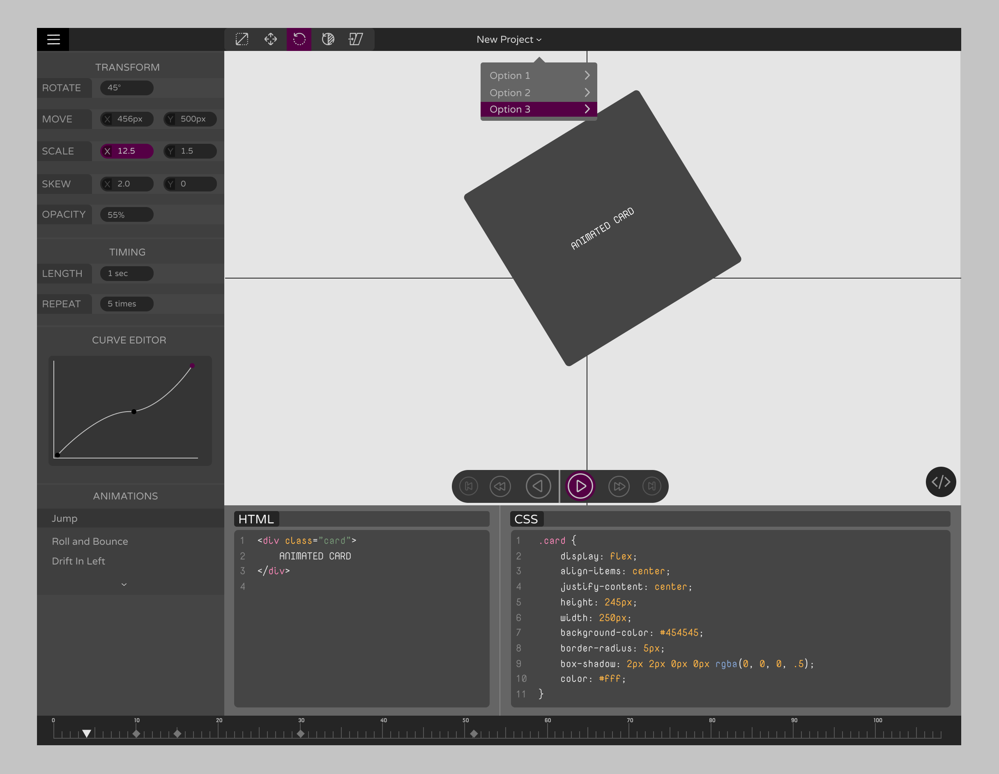

# kinema
A CSS Animation Studio (Work in Progress)

#### UI


#### Installation.
  * Install [Nodejs](https://nodejs.org/en/download/) if you don't already have it
  * Clone this repo ```git clone https://github.com/appcypher/kinema.git```
  * Run ```npm install``` to install the required dependencies
  * Run ```npm run build:dev:watch``` to serve the UI at localhost:9000 
  * Open http://localhost:9000/ in the browser
